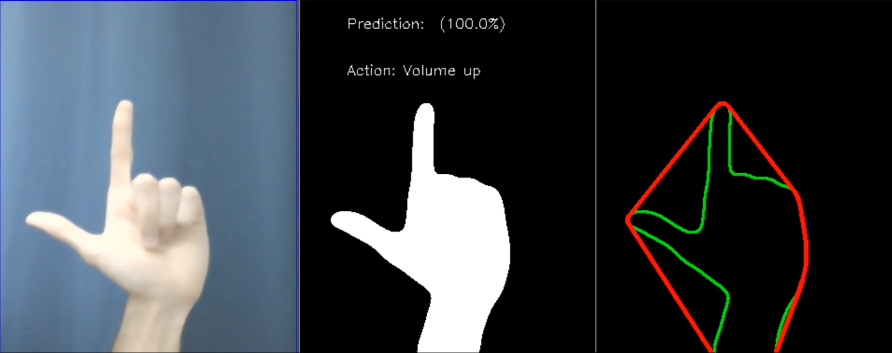

# Increasing Human Computer Bandwidth with Neural Networks and Under-Utilized Input Devices
## Using Python and OpenCV

_See a video of the finished product [here](https://www.youtube.com/watch?v=FLyxDO3_oUs)._
_Take a look at the presentation slides [here](https://github.com/sebastianrosado/deep-learning-capstone-project/blob/master/deliverables/final_capstone_presentation.pdf)._

